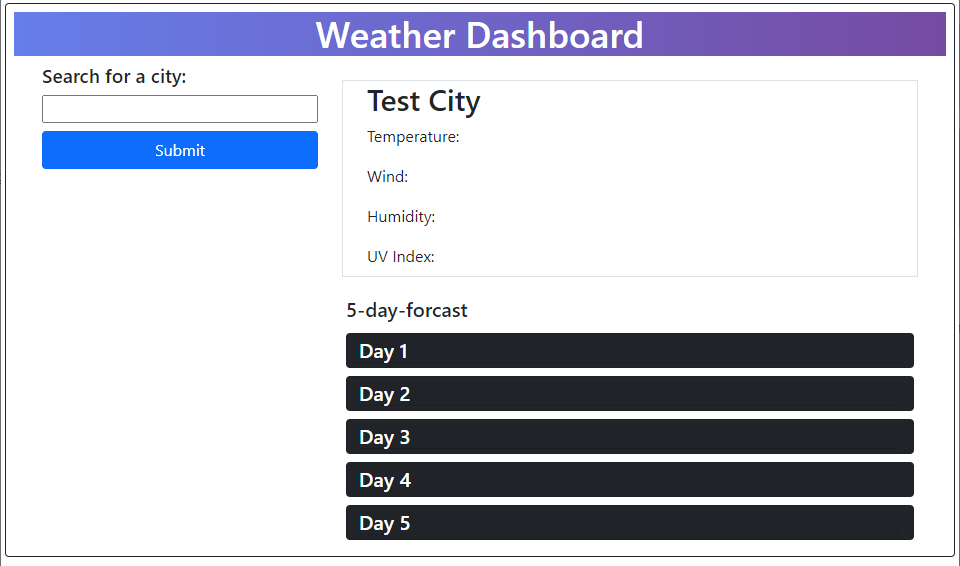
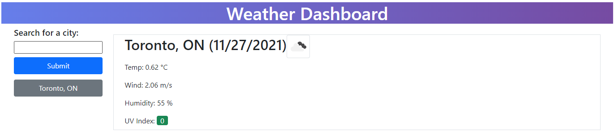
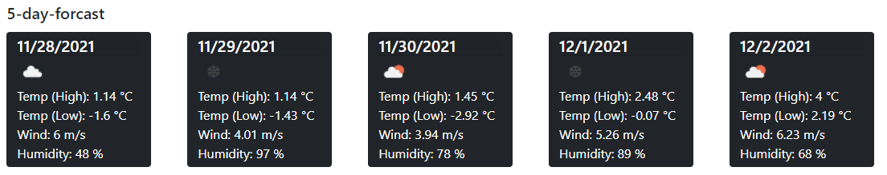
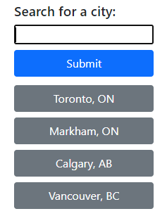

# weather-dashboard

Challenge 6 Using Third Party API with geocoding and weather API

## Website

[Check the weather today here!](https://fchoi1.github.io/weather-dashboard/)

## Technologies
Made using HTML, CSS, and Javascript with a focus on APIs, AJAX/Fetch,

## How to use the password generator

1. The current day is displayed, you can now add tasks on different days and the data saves!:

    

2. Click on a text area in a time slot to input a new event;

    * Grey timeblocks meaning that the event has past

    * Red timeblocks are events occuring now

    * Green timeblocks are events in the future

    

3. Press the blue save button on the right to save the event:

    Series of prompts to select which types of characters to use:

    

4. You can edit previous tasks buy simply clicking on them! (Don't forget to save changed tasks!)

    

4. You can remove tasks by clearing the event info! (Don't forget to save changed tasks!)

    
    
    

